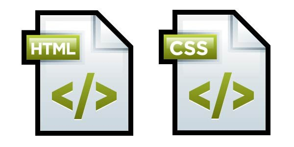

# <i><b>Основы веб-верстки HTML/CSS</b>
# <b>Home work 6</b>
## <b> Основы создания адаптивного сайта </b>

# <b>Задание:</b></i>
## Мы приступаем к созданию нового адаптивного проекта!!!

> https://www.figma.com/file/mnLY69cYE5cqWM5w6n5hXx/Seo-%26-Digital-Marketing-Landing-Page?node-id=188%3A2

Мы уже отлично умеем работать с макетом, в этом и есть основная задача верстальщика

1. Создать новую папку, в ней сделать заготовку:
- index.html (file)
- style.css (file)
- img (directory)

2. Полностью реализовать вёрстку проекта:
- Добавить весь контент из макета.
- Ко всем элементам контента добавить классы.
- Добавить стили для всего контента сайта.
- Расставить элементы в соответствии с макетом.
- Адаптив создавать не нужно.