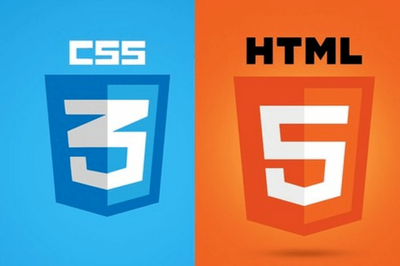

# <i><b>Основы веб-верстки HTML/CSS</b>
# <b>Home work 8</b>
## <b> Структура HTML5 и методология БЭМ </b>

# <b>Задание:</b></i>

Макет https://www.figma.com/file/mnLY69cYE5cqWM5w6n5hXx/Seo-%26-Digital-Marketing-Landing-Page?node-id=189%3A839

В данном уроке мы переходим к созданию мобильной версии проекта

1. Создать медиа запрос, чтобы наш проект отлично смотрелся на разрешениях экрана 320-767.

2. Создать мобильную версию проекта