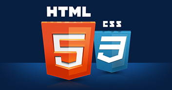

# <i><b>Основы веб-верстки HTML/CSS</b>
# <b>Home work </b>
## <b> Новые возможности CSS3. Добавление анимации </b>

# <b>Задание:</b></i>

> Макет 
> https://www.figma.com/file/mnLY69cYE5cqWM5w6n5hXx/Seo-%26-Digital-Marketing-Landing-Page?node-id=190%3A1194

На данном уроке нам необходимо доделать подвал, главной страницы интернет-магазина.

<u><i><b>
        Продолжаем работу с проектом из прошлого урока:
</b></i></u>

<b><i>

1. Добавляем весь контент подвала сайта.
2. Создаём планшетную версию проекта.
3. Создаем мобильную версию проекта.
4. Добавляем эффекты наведения.

</i></b>